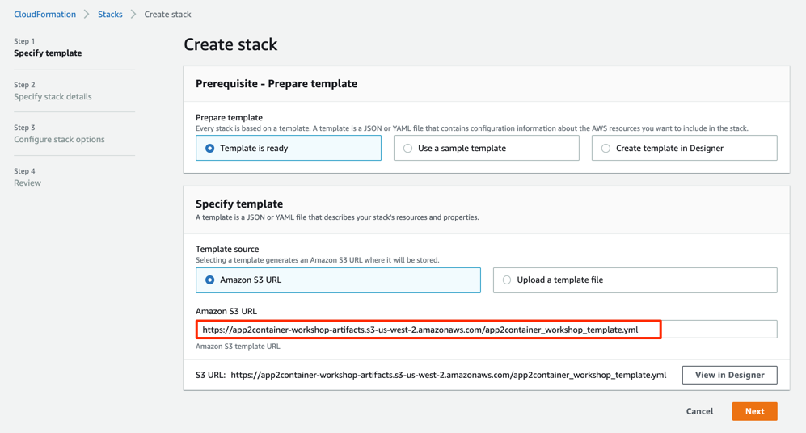
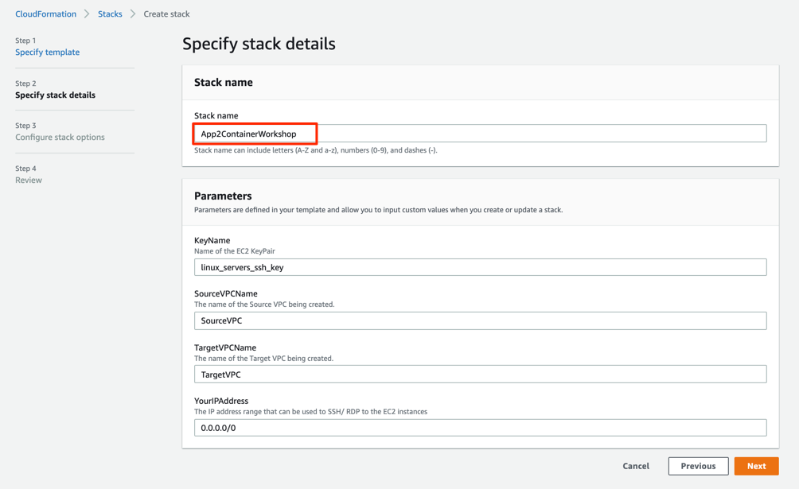
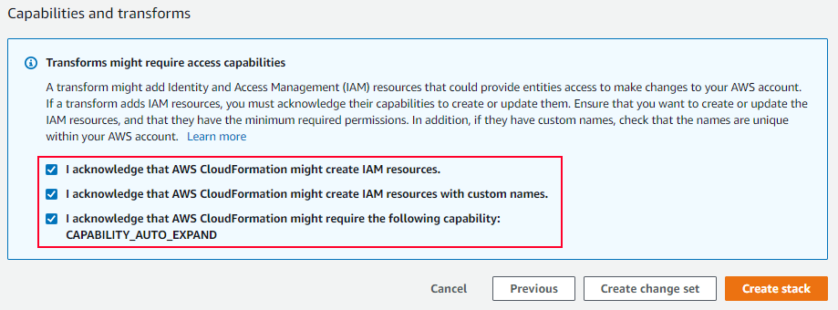
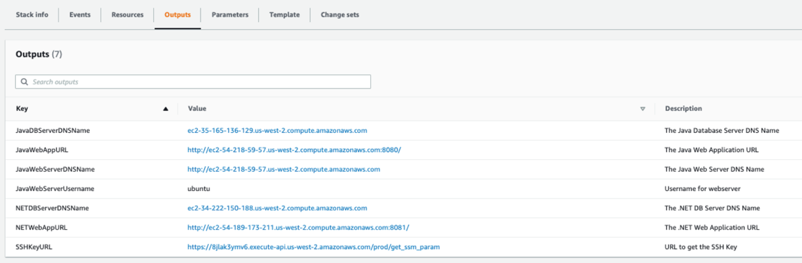

+++
title = "개인 계정으로 시작하기"
weight = 1
+++

{}
본 실습은 개인 계정을 이용하는 경우에만 수행합니다. AWS 호스팅 이벤트(예: re:Invent, GameDay, Workshop 또는 AWS 직원이 주최하는 다른 이벤트)를 사용하는 경우에는 다음의 [메뉴]({})로 이동 합니다.
{}

### 개인 계정으로 실습 환경 구성 하기

이 실습에서는 관리자 권한이 있는 AWS 계정에 액세스할 수 있다고 가정합니다. 새 AWS 계정을 생성하려면 새 Amazon Web Services 계정을 생성하고 활성화하는 방법을 따르십시오.

불필요한 요금을 받지 않도록 실습이 완료된 이후에 AWS 계정을 정리하는 것을 잊지 마십시오!

{}
이 워크샵은 us-west-2 지역에서 작동하도록 설계되었습니다. 이 지역을 선택했는지 확인하십시오.
{}

#### 실습 환경 배포

1. 아래의 Launch Stack 버튼을 클릭 하십시오.

2. 템플릿 지정에서 https://app2container-workshop-artifacts.s3-us-west-2.amazonaws.com/app2container_workshop_template.yml URL이 Amazon S3 URL 필드에 입력되었는지 확인하고 다음을 누르십시오.

3. 스택 세부 정보 지정 화면에서 App2 Container Workshop이 스택 이름 필드에 입력되었는지 확인하고 다음을 누릅니다.

{}
Public IP 주소를 "IP 주소" 입력란에 추가하여 IP 주소 액세스만 제한할 수 있습니다. (예: x.x.x.x/32). 기본값(0.0.0.0/0)은 모든 IP에 대해 트래픽을 허용합니다.
{}

4. 스택 옵션 구성 화면에서 변경하지 말고 다음을 누르십시오.

5. Review 화면에서 아래 화면과 같이 페이지 하단으로 스크롤하여 모든 확인란을 선택한 후 Next를 눌러 템플릿을 배포합니다.

{}
배포가 실패하면 배포 스택 이벤트 탭으로 이동하여 근본 원인을 확인합니다. 일반적인 근본 원인은 ecsExecutionRole 또는 ecsAutoscaleRoleIAM 역할이 AWS 계정에 이미 있기 때문입니다. 이러한 구성 요소를 삭제하고 소스 환경 CloudFormation 템플릿 배포를 다시 실행합니다.
{}

템플릿이 CREATE_COMPLETE 상태이면 AWS Console -> CloudFormation으로 이동하고 App2 Container Workshop 스택을 선택한 다음 출력 탭을 선택하여 생성된 소스 환경에 대한 정보를 찾을 수 있습니다. 아래와 같은 정보가 스크린샷에 표시됩니다.

이 정보를 복사 하여 여러분의 컴퓨터 메모장에 붙여 넣습니다.

#### 실습을 수행 하기 위한 준비가 완료 되었습니다.

모더나이제이션 실습을 위해서 애플리케이션(Java 또는 .NET) 을 선택 합니다.