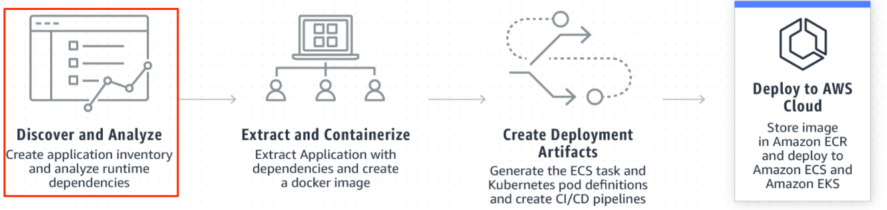

+++
title = "2.3 애플리케이션 탐색과 분석"
weight = 3
+++

현대화 프로세스는 시스템에서 실행 중인 Java 애플리케이션을 검색하여 인벤토리를 생성한 다음 분석하는 것으로 시작합니다.


####  1. 애플리케이션 인벤토리 작성

1. 다음 명령을 실행하여 서버에서 실행 중인 응용 프로그램을 나열합니다.

    ```bash
    app2container inventory
    ```
    
    Output 내용은 각 애플리케이션에 대한 노드가 있는 JSON 개체 모음입니다. 각 개체에는 키/값 쌍이 포함되며 아래와 같이 Java-app-id로 시작합니다.

    ```bash
    "java-app-id": {
    "processId": pid,
    "cmdline": "/user/bin/java ...",
    "applicationType": "java-apptype"
    }
    ```
    "java-tomcat-6c144e52"는 Java 애플리케이션 ID입니다. 다음 단계에서 사용할 수 있도록 애플리케이션 ID를 메모장에 복사합니다.
    ```bash
    {
    "java-tomcat-21fb1eb0": {
    "processId": 1033,
    "cmdline": "/usr/bin/java ... -Dcatalina.home=/usr/local/tomcat8 -Djava.io.tmpdir=/usr/local/tomcat8/temp org.apache.catalina.startup.Bootstrap start ",
    "applicationType": "java-tomcat",
    "webApp": "ROOT"
    }
    }
    ```
####  2. 애플리케이션 분석

