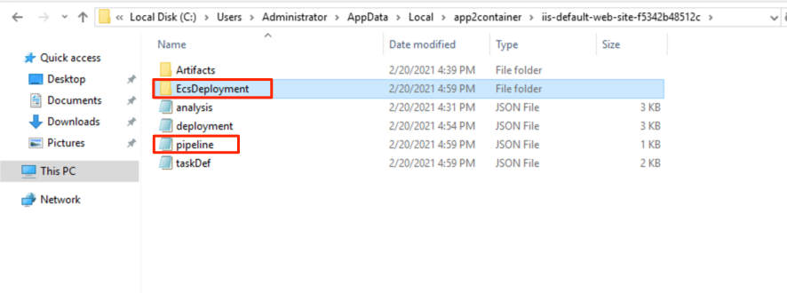

+++
title = "2.5. 배포 아티팩트 생성"
chapter = true
weight = 75

+++
이 단계에서 App2Container는 AWS에서 애플리케이션 컨테이너를 배포하는 데 필요한 아티팩트를 생성합니다. App2Container는 프로필, 애플리케이션 분석 및 모범 사례를 기반으로 아티팩트의 키 값을 미리 채 웁니다.

대상 컨테이너 관리 환경에 배포하기위한 두 가지 옵션이 있습니다 (Amazon ECS 또는 Amazon EKS를 사용하는 Amazon ECR).

{}
이 시나리오에서는 Amazon ECS를 사용하여 애플리케이션 컨테이너를 Amazon ECR에 배포합니다.
{}


1. “app2container generate app-deployment” 명령을 실행하여 배포를 위한 CloudFormation template을 생성합니다.

   ```
   app2container generate app-deployment --application-id <net-app-id>
   ```

2. 이 과정에는 몇분이 소요됩니다. 아래와 같은 출력화면을 볼 수 있어야 합니다.

   

이 명령을 사용하여 App2container는 다음 활동을 수행합니다.

1. ECR (Elastic Container Registry) Repository 를 생성하고 애플리케이션 컨테이너 이미지를 레지스트리로 이동합니다.

   - AWS 콘솔에서 ECS Service로 이동합니다.

     - 왼쪽 화면에서 "Amazon ECR" 을 클릭합니다.

     - 여러분의 컨테이너가 자동으로 ECR repository 에 등록된 것을 확인할 수 있습니다.

       

   - Repository를 클릭하면 "latest"태그가있는 컨테이너 이미지가 배포 된 것을 볼 수 있습니다.

     

{}
"analysis.json"파일에서 이 태그 및 기타 컨테이너 매개 변수를 업데이트 할 수 있습니다.
{}

2. ECS Task Definition을 생성하고 이를 ECS에 등록합니다.

   1. 참고 : ECS에서 도커 이미지를 실행하는 데 필요한 ECS Task Definition. Task Definition에 대한 자세한 내용은 [Amazon ECS Tesk Definition](https://docs.aws.amazon.com/AmazonECS/latest/developerguide/task_definitions.html) 를 참조하십시오.

      

3. 모든 CloudFormation 리소스들을 선택된  S3 버킷에 업로드 합니다.

   - 참고 : 이전 단계인 App2container 설치 및 초기화 섹션에서이 버킷을 정의했습니다.

   - S3 서비스로 이동합니다. 그리고 초기에 정의된 버킷으로 이동합니다.

   - app2container가 모든 애플리케이션에 대해 별도의 버킷을 생성하고 모든 배포 아티팩트가 해당 버킷에 업로드 된 것을 볼 수 있습니다.

     

4. CloudFormation Master 템플릿을 생성합니다.

   1. App2Container는 환경을 검토하고 이전 단계, 애플리케이션 분석 및 모범 사례에서 정의한 원하는 구성을 기반으로 Cloudformation 템플릿을 미리 채웁니다.

   2. 이 CloudFormation 템플릿은 필요한 모든 리소스와 해당 종속성을 설명하므로, 이를 스택으로 함께 시작하고 구성할 수 있습니다.

   3. Worker machine에서 아래와 같이 응용 프로그램 폴더의 EcsDeployment 폴더 위치를 찾아 파일을 엽니 다.

      

   4. 아래 화면에서 처럼 ecs-master.yml 파일은 EcsDeployment 폴더아래 위치하며, 이 파일을 엽니다.

      

{}
이 워크숍에서는 이 파일을 변경할 필요가 없습니다. 하지만 필요에 따라서 이 파일을 업데이트 할 수도 있습니다.
{}

이제 모든 준비가 완료되었으며 .NET 애플리케이션을 AWS ECS에 배포할 준비가 되었습니다! 배포를 트리거하려면 다음 섹션을 계속 진행합니다.
