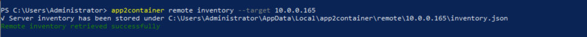
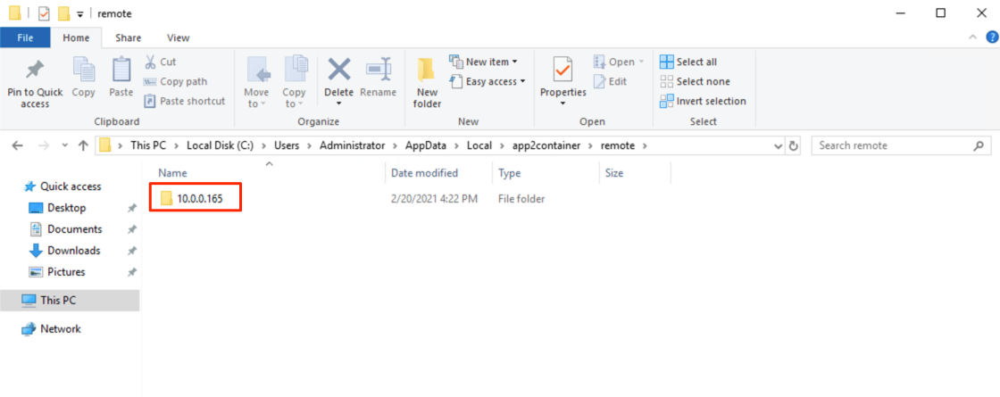
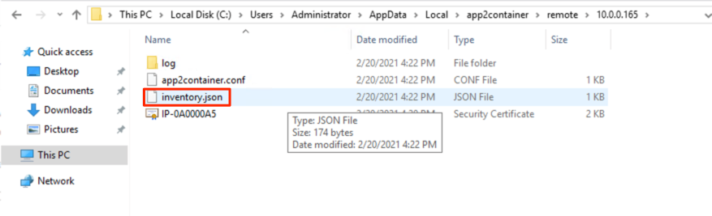
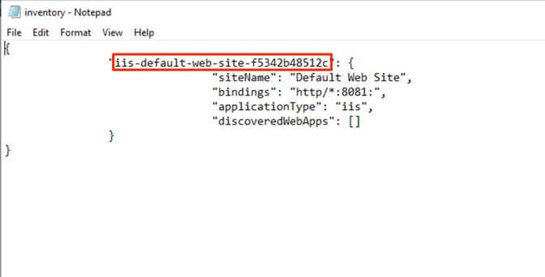
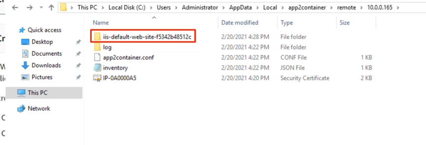
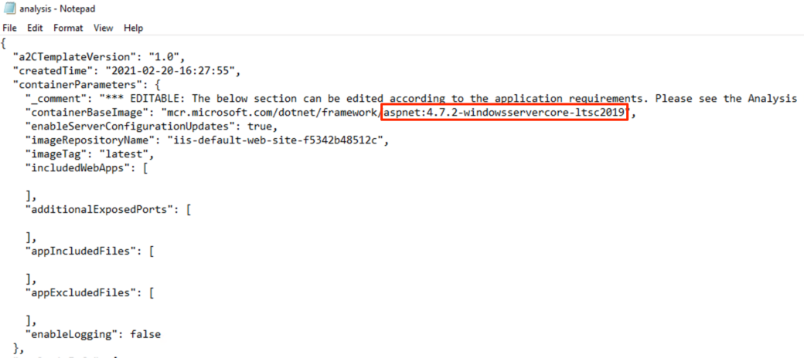
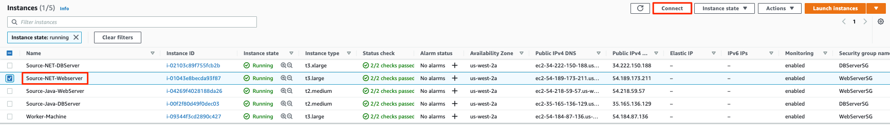

+++
title = "2.3. 발견과 분석"
chapter = true
weight = 73

+++
App2container 프로세스는 애플리케이션 인벤토리를 생성하고 이를 분석하여 서버에서 실행중인 .NET 애플리케이션을 검색하는 것으로 시작됩니다.


{}
"Java 앱 모더나이제이션(현대화)"섹션에서 이미 S3 버킷을 생성 한 경우 동일한 버킷을 재사용 할 수 있으며, 이 단계를 건너 뛸 수 있습니다.
{}

1. #### 애플리케이션 인벤토리 생성

   모든 App2container 프로세스에 Worker machine을 사용하고 있으므로 "원격"프로세스를 사용하게됩니다. Worker machine에서 원격 명령을 실행하면 소스 서버에 연결하여 명령을 실행합니다.

   {}
   Worker machine을 원격 연결과 함께 사용하면 확장 활동(scaling activities)을 표준화 할 수 있습니다.
   {}

   

   1. 다음과 같이 "app2container remote inventory"명령을 실행하여 서버에서 실행중인 .NET 응용 프로그램을 나열합니다.

      - “소스 서버” 의 사설 IP주소를 "타겟" 파라메터에 사용합니다. 

        ```
        app2container remote inventory --target <private-IP of your source server>
        ```

      - 명령을 실행하면 아래와 같이 "원격 인벤토리가 성공적으로 검색 됨"출력이 표시됩니다.

        

   2. App2container는 Worker machine의 각 "Target" 소스 서버에 대해 별도의 폴더를 만듭니다.

      - 아래와 같이 “C:\Users\Administrator\AppData\Local\app2container\remote"  폴더로 이동합니다.
      - “소스 서버” IP 주소로 만들어진 폴더를 볼 수 있습니다.

      

   

   {}
   Appdata 폴더는 기본적으로 숨김 폴더입니다. 이 폴더가 보이지 않으면 “View” > “Hidden items” 체크 박스를 선택하세요. 또는 "C : \ Users \ Administrator \ AppData"폴더로 직접 이동합니다.
   {}

   

   3. 폴더 내에 app2container가 소스 서버에 원격으로 .NET 애플리케이션 인벤토리를 검색한 "inventory.json"파일을 볼 수 있습니다.

   

   4. 메모장으로 "inventory.json"파일을 엽니다. 파일에는 각 애플리케이션에 대한 항목이 하나씩 있는 JSON 개체 컬렉션이 포함되어 있습니다.
      - 각 응용 프로그램 개체에는 키 / 값 쌍이 포함되며 아래와 같이 .NET-app-id로 시작됩니다 (iis-default-web-site-f5342b48512c).
      - 다음 단계에서 사용할 응용 프로그램 ID를 메모장에 복사합니다.

   

2. #### 어플리케이션 분석

   1. 인벤토리 명령의 JSON 출력에서 애플리케이션의 애플리케이션 ID를 찾은 후 다음과 같이“app2container remote analyze –application-id <net-app-id> –target <source-server-private-IP>”명령을 실행합니다. net-app-id를 이전 단계에서 복사 한 애플리케이션 ID로 바꿉니다.

      ```
      app2container remote analyze --application-id <net-app-id> --target <source-server-private-IP>
      ```   

      

   2. "Analyze"명령의 출력화면은 app2container가 완료한 작업과 다음 단계에 대한 권장 사항을 제공합니다.

      

   3. Analyze 명령을 통해 App2container는 각 응용 프로그램에 대한 폴더를 만듭니다. 아래와 같이 찾아서 폴더 내부로 이동하십시오.

      

   4. 폴더 내에서 analysis.json 파일을 찾고 검토를 위해 메모장으로 파일을 엽니다.

      파일을 열면 analysis.json 파일에 EDITABLE 및 NON-EDITABLE의 두 섹션이 있음을 알 수 있습니다.

      - EDITABLE 섹션에는 ContainerBaseImage 또는 이미지 태그와 같은 선호 설정을 지정할 수있는 컨테이너 매개 변수가 포함되어 있습니다. 이러한 매개 변수는 나중에 컨테이너화 프로세스 중에 사용됩니다. 이 실습에서는 컨테이너 기본 이미지가 Windows 2012에서 Windows 2019로 업그레이드됩니다.

      

      - NON-EDITABLE 섹션에는 OS 데이터, 사용중인 포트, 종속성, 소프트웨어 라이브러리 등과 같은 컨테이너화 중에 app2container가 사용할 애플리케이션 수준 분석 정보가 포함됩니다
      
{}
 운영 체제를 업그레이드하는 기능은 컨테이너화 과정의 가장 큰 이점 중 하나입니다. App2container를 사용하면 이 과정을 대규모로 처리할 수 있습니다.
{}
      




- ​					NON-EDITABLE 섹션에는 OS 데이터, 사용중인 포트, 종속성, 소프트웨어 라이브러리 등과 같은 컨테이너화 중에 app2container가 사용할 애플리케이션 수준 분석 정보가 포함됩니다.

{}
이 분석은 레거시 애플리케이션으로 작업하거나 애플리케이션 문서가 충분하지 않은 경우 특히 중요합니다.
{}

이 단계에서 분석을 완료한 후 다음 섹션에서 애플리케이션의 컨테이너화를 계속할 수 있습니다.
