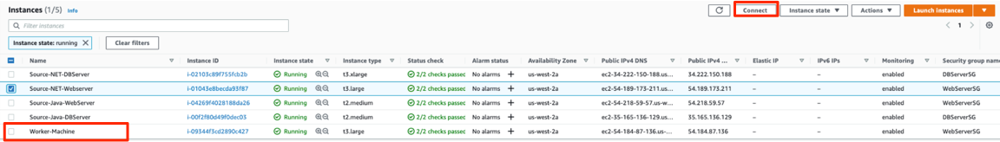
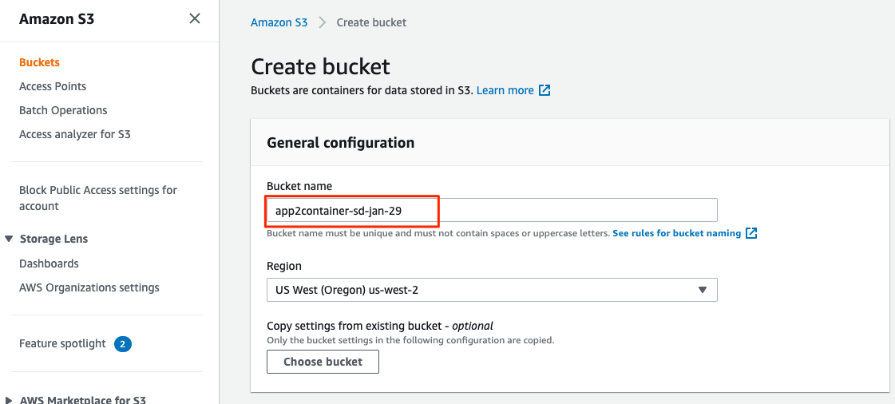
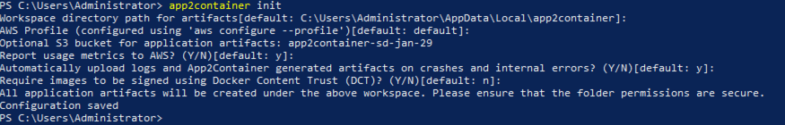
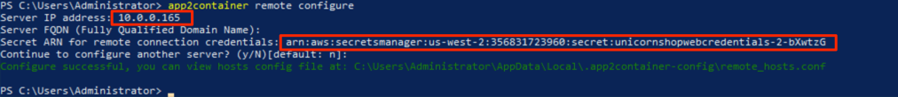

+++
title = "2.2 APP2CONTAINER 설치 및 초기화"
chapter = true
weight = 72

+++
#### 1. Worker Machine에 app2continer 설치

1. Windows 인스턴스 연결 섹션에 설명된 대로 작업자 머신(Worker Machine)에 연결합니다.

   1. 아래와 같이 EC2 서비스로 이동하여 작업자 머신을 찾을 수 있습니다. Name: "Worker Machine"

      

2. 웹 브라우저를 열고 다음 위치에서 AWSApp2Container Windows 설치 프로그램을 서버로 다운로드합니다.

   https://app2container-release-us-east-1.s3.us-east-1.amazonaws.com/latest/windows/AWSApp2Container-installer-windows.zip

3. 설치 프로그램 파일은 "Downloads" 폴더에 다운로드됩니다. "Downloads 폴더"로 이동하여 "AWSApp2Container-installer-windows.zip" 파일의 압축을 풉니다.

3. "install.ps1" powershell 스크립트를 실행하고 명령 출력에서 프롬프트가 표시되면 "R"을 입력합니다. 그런 다음 "y"를 눌러 이용 약관에 동의하십시오.

   ```
   ./install.ps1
   ```

   

   

5. (선택 사항) App2Container에 사용 가능한 명령을 숙지하십시오.

   1. 다음 명령을 실행하면 사용할 수 있는 app2container 명령을 확인할 수 있습니다. 

   ```
   app2container help
   ```

#### 2.App2Container 초기화

1. init 명령은 App2Container에 대한 일회성 초기화 작업을 수행합니다. 이 대화형 명령은 로컬 App2Container 환경을 설정하는 데 필요한 정보를 입력하라는 메시지를 표시합니다.

   1. 먼저 App2Container가 컨테이너화 프로세스 중에 아티팩트를 저장할 수 있는 Amazon S3 버킷을 생성해야 합니다.

   {}
   "Java 앱 모더나이제이션(현대화)"섹션에서 이미 S3 버킷을 생성 한 경우 동일한 버킷을 재사용 할 수 있으며, 이 단계를 건너 뛸 수 있습니다.
   {}

      1. S3 콘솔로 이동하여 버킷의 고유 한 이름 (app2container- <Your-Initials>-<Date>)을 입력하고 create를 클릭하고 메모장에 버킷 이름을 저장합니다 (다음 단계에서 필요함).

         

      2. Worker Machine에서 "app2container init"명령을 사용하여 app2container를 초기화합니다.
      
         ```
         app2container init
         ```
      
         다음 정보를 제공하라는 메시지가 표시됩니다.
      
         | 파라메터                            | 값                                                           |
         | :---------------------------------- | :----------------------------------------------------------- |
         | Workspace directory path            | 기본값 (App2Container가 아티팩트를 컨테이너화 과정에서 아티팩트를 저장할 수 있는 로컬 디렉터리. 기본값은 C:\Users\Administrator\AppData\Local\app2container) |
         | AWS profile                         | 기본값 (Contains information needed to run App2Container, such as your AWS access keys.) |
         | Amazon S3 bucket                    | 이전 단계에서 생성한 Amazon S3 버킷이름 (app2container-Your-Initials-Date). (e.g. sd-jan-29) |
         | Permission to collect usage metrics | 기본값 (이 옵션은 App2Container 가 호스트 운영체제, 어플리케이션 타입 그리고 실행할 수 있는 app2container 명령을 수집할 수 있게 허용함) |
         | Whether to enforce signed images    | 기본값 (옵션으로 Docket Content Trust (DCT) 를 사용하여 이미지가 사인되어야 함을 요구할 수 있음) |

   {}
   메시지가 표시되면 이전 단계에서 생성한 Amazon S3 버킷 이름 (app2container-Your-Initials-Date)을 입력해야합니다. 아래 예제 출력을 참조하십시오.
   {}

   

   #### 3. 원격 연결 구성

   응용 프로그램 서버에서 원격 워크 플로를 실행하는 데 필요한 연결을 구성하려면 작업자 컴퓨터에서 "remote configure"명령을 실행해야합니다. 이 대화식 명령은 입력하는 각 응용 프로그램 서버에 필요한 정보를 입력하라는 메시지를 표시합니다.

   | 파라메터                               | 값                                                           |
   | :------------------------------------- | :----------------------------------------------------------- |
   | Server IP Address                      | Source Server (Source-NET-Webserver)사설 IP 주소. <br />(EC2 콘솔 > Source-NET-Webserver> Details> Private IPv4 addresses) |
   | Server FQDN                            | 빈칸으로 남겨둠                                              |
   | Secret ARN                             | 이전 단계에서 AWS Secrets Manager 에서 생성한 Secret의 ARN   |
   | Continue to configure another server ? | n                                                            |

   {}
   웹 서버의 사설 IP 주소를 메모장에 복사해두고 다음 섹션에서 사용합니다.
   {}

   ```
   app2container remote configure
   ```

   

   {}
   대규모 프로젝트를 위해, 이 단계에서 여러 서버를 구성 할 수 있습니다.
   {}

  이제 작업자 머신(Worker Machine)에 App2container를 설치하고 초기화했으며, 소스 애플리케이션 서버에 직접 액세스하지 않고 app2container 프로세스를 원격으로 실행하여 .NET 애플리케이션을 컨테이너화 할 준비가되었습니다.

   

​	


