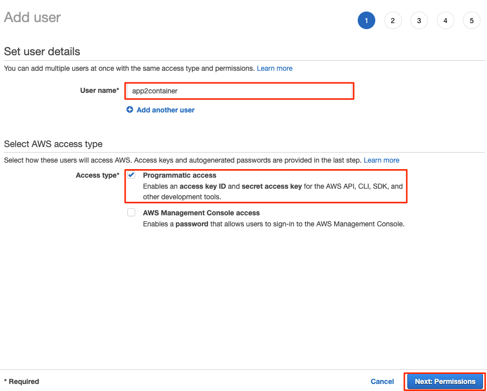
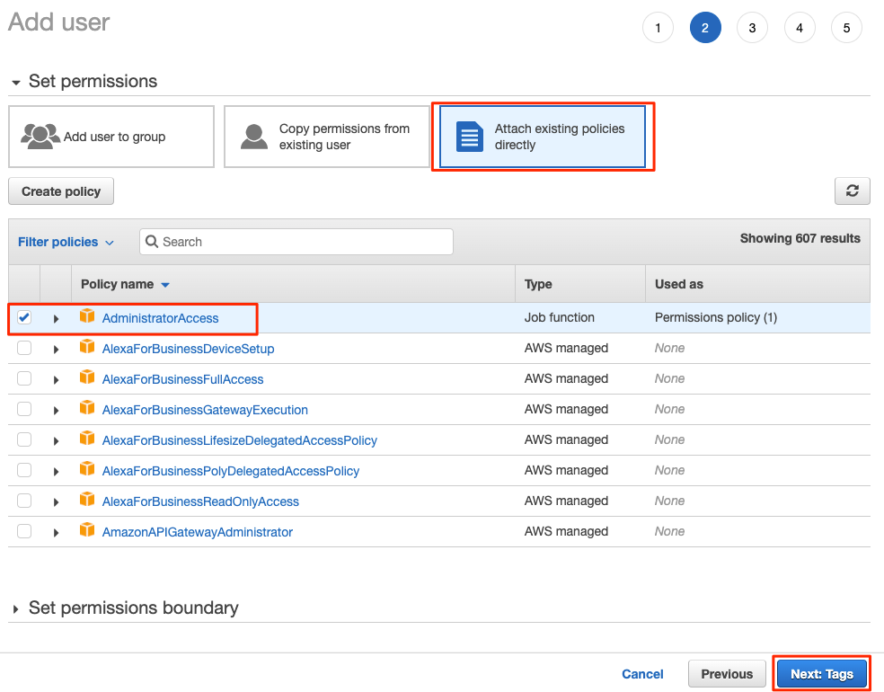
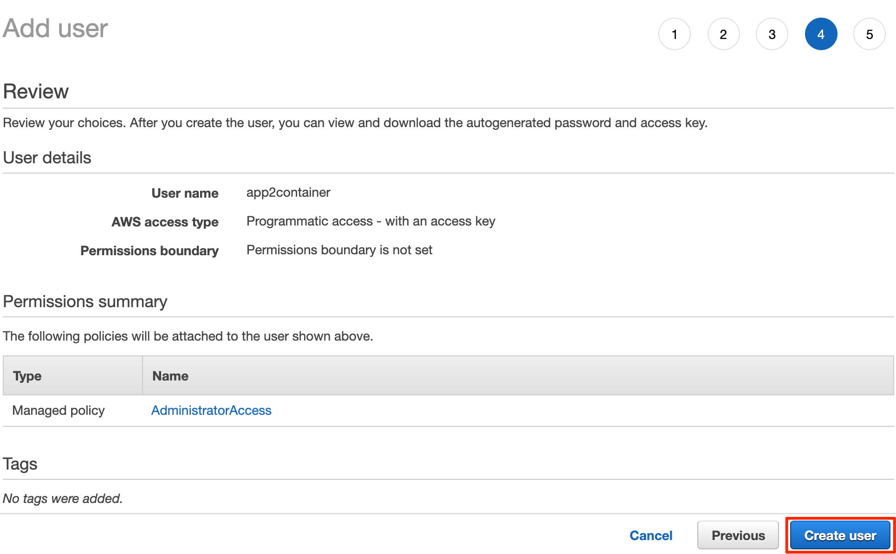
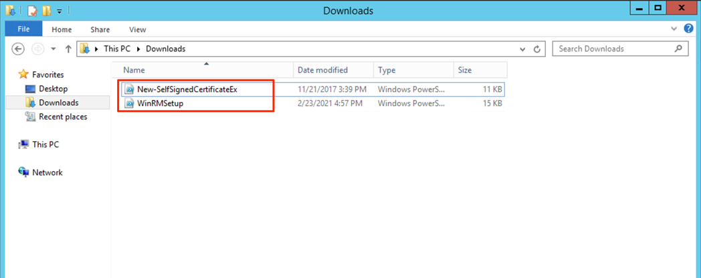
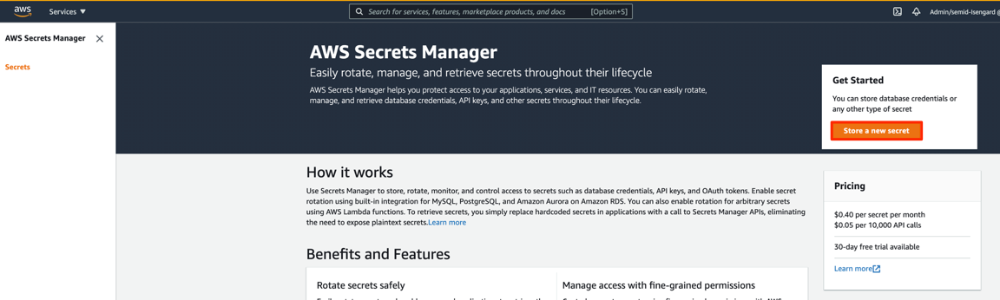
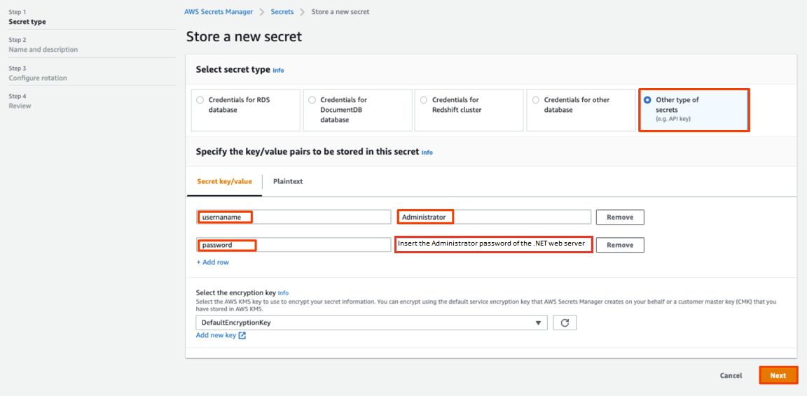
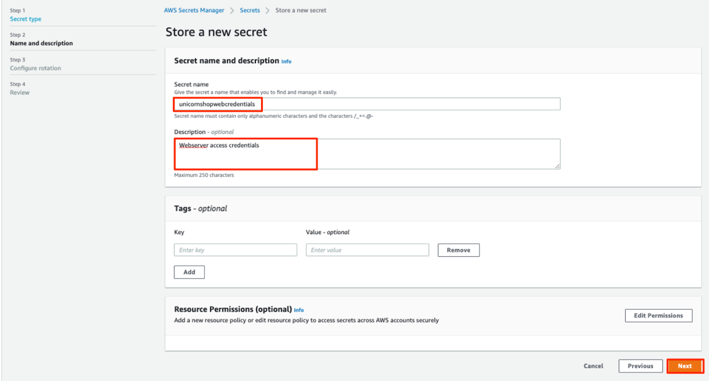
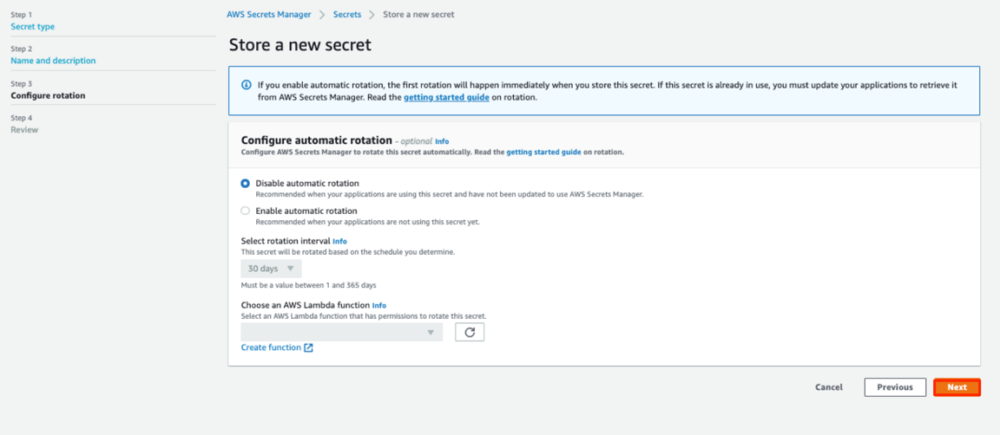
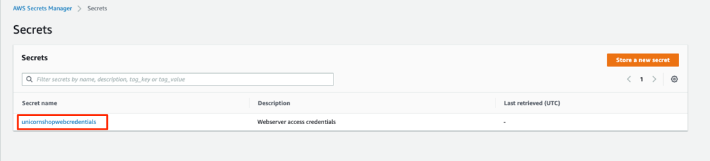
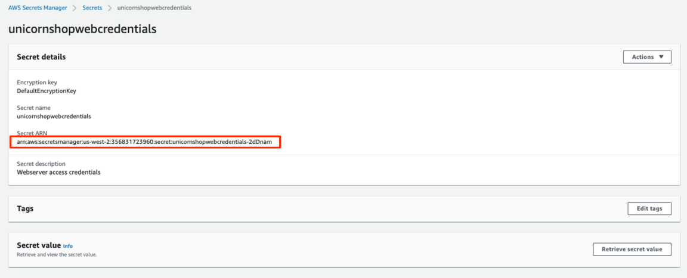

+++
title = "2.1. APP2CONTAINER 사전 요건"
weight = 71

+++
AWS App2Container를 처음 사용하기 전에 아래의 사전 요건을 완료해야합니다. 이 실습에서는 모든 필수 구성 요소 도구를 미리 설치하고 이러한 필수 구성 요소와 호환되는 소스 환경을 만들었습니다.

[App2Container 사전 요건 ](https://docs.aws.amazon.com/app2container/latest/UserGuide/start-containerize-java-app.html)에서 사전 요건 체크리스트를 확인할 수 있습니다.

다음 단계로 아래 작업에 따라 App2Container 서비스를 설정하십시오.

#### 1. IAM 사용자에 권한 부여

{}
이전 모듈 (Java 앱 모더나이즈)을 완료하고 app2container에 대한 IAM 사용자를 생성한 경우, 이 단계를 건너 뛸 수 있습니다.
{}

App2Container에서 대부분의 명령을 실행하기 위해 AWS 서비스에 대한 액세스 권한이 필요합니다. app2container 명령을 실행하는 데 필요한 두 가지 매우 다른 권한 세트가 있습니다.

- 범용 사용자 또는 그룹은 –deploy 옵션으로 실행되는 명령을 제외한 모든 명령을 실행할 수 있습니다.
- 배포를 위해 App2Container는 컨테이너 관리 서비스 (Amazon ECR과 Amazon ECS 또는 Amazon EKS)를위한 AWS 객체를 생성 또는 업데이트하고 AWS CodePipeline을 사용하여 CI / CD 파이프 라인을 생성 할 수 있어야합니다. 이를 위해서는 배포에만 사용해야하는 높은 권한이 필요합니다.

범용 IAM 리소스를 생성하는 것이 좋으며 App2Container를 사용하여 컨테이너를 배포하거나 파이프 라인을 생성하려는 경우 권한이 상승된 배포를위한 별도의 IAM 리소스를 생성하는 것이 좋습니다.

{}
이 워크숍에서는 App2Container에서 지원하는 배포용 AWS 서비스를 사용하여 컨테이너화 된 애플리케이션을 배포 할 수 있도록 관리자 권한이있는 사용자를 생성합니다.
{}

1.  “Services” 를 클릭하여 **IAM** 콘솔로 이동 > >“IAM” (Identity Access Management)**

   - 왼쪽 창에서 User >> Add User  클릭
   - **Programatic access**  체크박스에 체크
   - **Next : Permission** 을 클릭

   

2. App2Container 사용자의 권한을 설정합니다.

   -  “Attach existing policies directly” 선택

   - “AdministratorAccess” 체크

   - “Next: Tags” 클릭

     
     
     
     
     

3. 확인 및 사용자 생성

   1. “Next: Review” 를 선택하고 "Create User" 클릭

   2. Success 화면에서, Access key ID 와 Secret Access Key 를 복사합니다. 

      이전 단계에서 생성한 app2container 사용자를 위한 자격 증명을 사용합니다.
      
      

   #### 2. 소스 웹 서버에서 WinRM 활성화

   Windows Server 2019 작업자 컴퓨터에서 Windows 원본 서버에 연결하려면 원본 웹 서버에서 WinRM 프로토콜을 활성화해야합니다.

   {}
   응용 프로그램 서버는 [지원되는 응용 프로그램 목록](https://docs.aws.amazon.com/app2container/latest/UserGuide/supported-applications.html)에서 Windows의 요구 사항을 충족해야합니다.
   {}

   

   1. Windows 인스턴스 연결 섹션에 설명 된대로 RDP 프로토콜을 사용하여 Source-NET-Web Server에 연결합니다.

      - 아래와 같이 EC2 서비스로 이동하여 소스 웹 서버를 찾을 수 있습니다. 원본 DB 서버 이름은“Source-NET-Web-Server”입니다.

        

   {}
   Windows 인스턴스 연결 섹션에 설명된대로 웹 서버 비밀번호를 확인하십시오. 웹 서버 암호를 메모장에 복사하고 다음 단계에서 사용합니다.
   {}

   2. 다운로드 폴더로 이동합니다. 이 workshop을 위해 두 개의 파일이 다운로드 된 것을 볼 수 있습니다.

      - WinRMSetup

      - New-SelfSignedCertificateEx

        
      
   3. Powershell 콘솔을 엽니다.

   4. "Downloads" 폴더로 이동후  "ls" 명령을 실행하여 WinRMSetup.ps1 및 New-SelfSignedCertificateEx.ps1 파일이 동일한 위치에 있는지 확인합니다.

      ```
      cd Downloads
      ls
      ```

   5. "WinRMSetup.ps1"명령을 실행하고 명령 출력에서 메시지가 표시되면 "R"을 입력합니다.

      ```
      .\WinRMSetup.ps1
      ```

      - 아래 화면과 유사한 출력화면을 보게됩니다.

         

         
      
         이제 포트 5986에서 winRM 프로토콜을 통해 액세스 할 수 있도록 소스 웹 서버를 구성했습니다. 이제 원격 작업자 컴퓨터에서 액세스 할 수 있습니다.

   #### 3. AWS Secrets Manager에 Secret 저장

   App2Container는 AWS Secrets Manager를 이용해서 원격 명령 실행을 위한 작업자 머신(Worker Machine)이 애플리케이션 서버에 연결에 사용하는 자격 증명을 관리합니다. Secrets Manager는 저장을 위해 암호를 암호화하고 암호에 액세스 할 수 있도록 Amazon 리소스 이름 (ARN)을 제공합니다.

    Remote configure 명령을 실행할 때, Secret ARN을 제공해야 하는데 이는 App2Container가  원격 명령을 수행하기 위한 타겟 서버연결에 사용할 합니다.

   1. AWS Secrets Manager 로 이동 후, “Store a new secret” 을 클릭합니다.

      

   2. “Other type of secrets” 을 선택하고 아래 파라메터를 추가한 후 "Next"를 클릭합니다.

      | Key      | Value                                                        |
      | :------- | :----------------------------------------------------------- |
      | username | Administrator                                                |
      | password | Copy your Web Server password you get in previous steps while connecting to Web Server. |

      

   3. **Secret Name** 을 (e.g “unicornshopwebcredentials”) 형태로 입력하고 **Description**을 입력합니다. "Next"를 클릭합니다.

      

   4. 다른 설정은 모두 기본값으로 두고 “Next”를 클릭합니다.

      

   5. Secret 이 저장된 후, 아래 화면처럼 "Secret name"을 클릭합니다.

      

   6. 아래 화면에서 처럼 “Secret ARN” 을 노트패드에 복사합니다. 이후 단계에서 사용하게 됩니다.

      

   #### 4. 작업자 머신(Worker Machine)에 AWS 프로파일 구성

   모든 App2Container 프로세스를 위해 작업자 머신을 사용하므로, 작업자 머신에 AWS 프로필을 구성해야 합니다.

   1. Windows 인스턴스 연결 섹션에 설명된 대로 작업자 컴퓨터에 연결합니다.

   Worker machine 에서 App2Container가 사용할 수 있는 AWS CLI에 대한 프로필을 생성해야 합니다. 이 실습에서는 powershell을 열고 'aws configure'를 실행하여 기본 프로필을 설정합니다.

   {}
   이전 단계에서 만든 app2container User Detail의 자격 증명으로 사용합니다.
   {}

   ```
   aws configure
   
     AWS Access Key ID [None]: <<add AWS access key from previous steps>>
     AWS Secret Access Key [None]: <<add AWS secret access key from previous steps>>
     Default region name [None]: us-west-2
     Default output format [None]: [blank]
   
   ```

   이 단계에서는 여러분의 환경에 App2Container를 설치할 사전 조건을 설정했습니다. 다음 섹션에서는 Worker Machine에 App2Container를 설치하고 컨테이너화 프로세스를 시작하도록 설정합니다.


