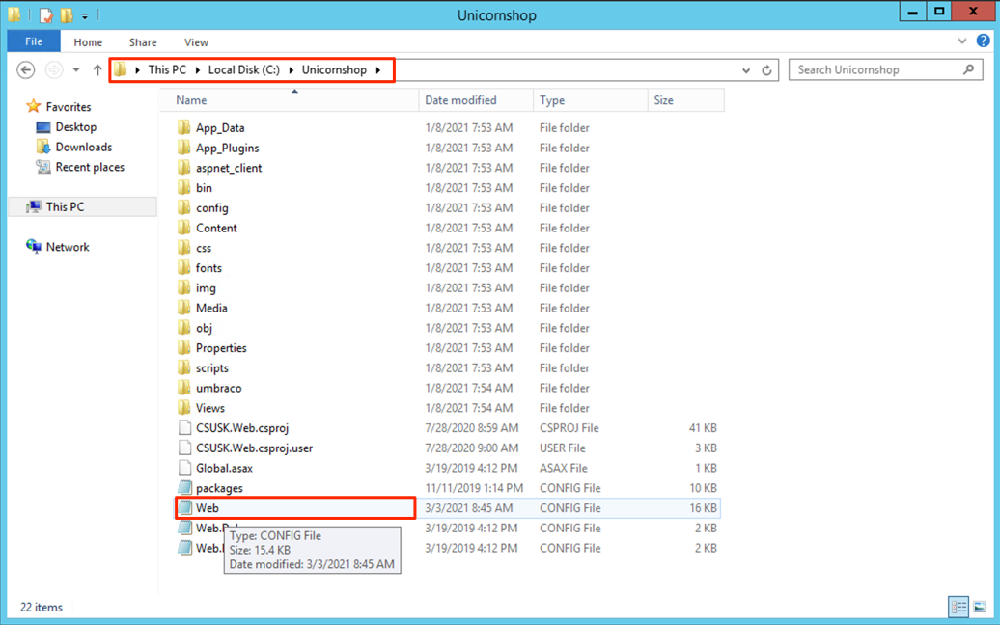
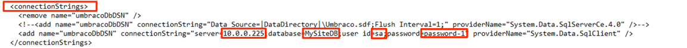
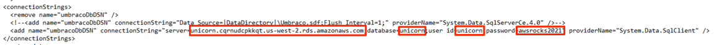
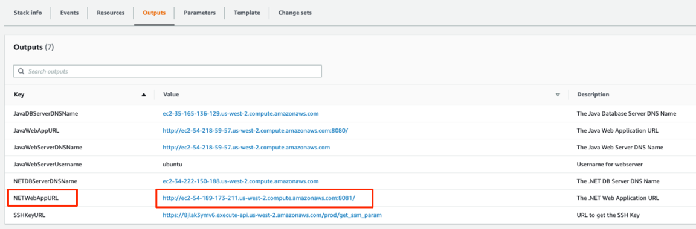
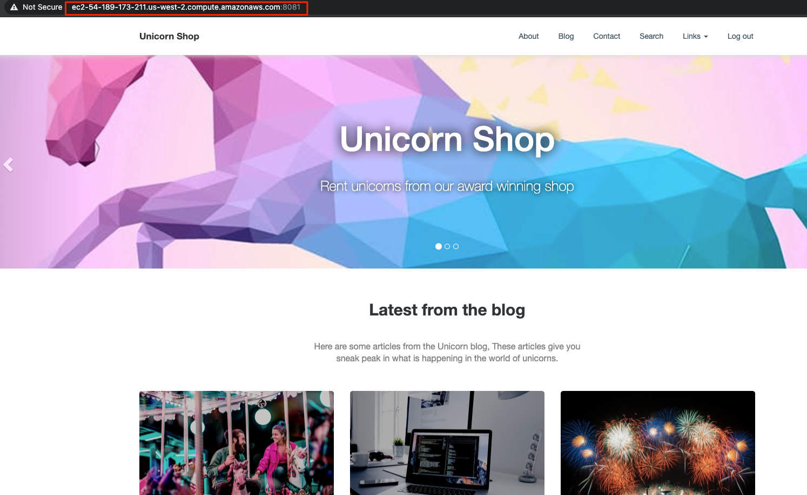

+++
title = "1.4 애플리케이션에서 Connection String 변경"
weight = 64

+++
 Amazon RDS에 새 Microsoft SQL 데이터베이스를 성공적으로 생성하고 기존 데이터베이스를 마이그레이션했습니다.

이제 애플리케이션이 새로 마이그레이션 된 데이터베이스를 사용하기 시작하도록 소스 .NET 애플리케이션 서버에서 데이터베이스 엔드 포인트 구성 설정을 변경합니다.

1. Windows 인스턴스 연결 섹션에 설명 된대로 소스 .NET 웹 서버에 연결합니다.
   - 아래와 같이 EC2 서비스로 이동하여 소스 .NET 웹 서버를 찾을 수 있습니다. 소스 NET 웹 서버 이름은 "Source-NET-WebServer"입니다.
   
     
   
2. .NET 응용 프로그램은 응용 프로그램 폴더에있는 "web.config" 파일에서 데이터베이스 연결 구성을 가져옵니다.

   - "c : \ Unicornshop”에있는 응용 프로그램 폴더로 이동하여 아래와 같이 Web.config 파일을 엽니 다.

     

3. 파일을 열고 **< connectionStrings >** 섹션으로 이동합니다.

   - DB 매개 변수가 이미 소스 DB 매개 변수로 설정되어있는 것을 볼 수 있습니다.

     

4. RDS 대상 DB 값으로 매개 변수를 업데이트합니다.

   | 파라메타 | 값                                                           |
   | :------- | :----------------------------------------------------------- |
   | server   | Your RDS endpoint URL                                        |
   | database | unicorn                                                      |
   | user id  | unicorn ((RDS DB 생성시 다른 사용자를 사용했다면 해당 계정을 입력합니다.) |
   | password | awsrocks2021 ((RDS DB 생성시 다른 암호를 사용했다면 해당 암호를 입력합니다.) |

   

5. 이제 Cloudformation으로 이동하여 NETWebAppURL (아래 그림 참조)을 복사하여 브라우저에 붙여 넣습니다. 웹 애플리케이션이 새 마이그레이션 된 데이터베이스와 함께 작동하는 것을 볼 수 있습니다.

   

데이터베이스를 성공적으로 마이그레이션했으며 이제 웹 애플리케이션이 마이그레이션 된 RDS 데이터베이스를 사용하고 있습니다.

